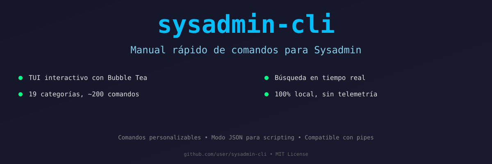
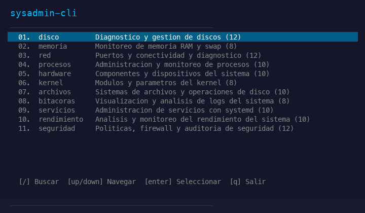

<p align="center">
  
</p>

<p align="center">
  
</p>

<p align="center">
  Manual rapido de comandos para Sysadmin — TUI interactivo + CLI + JSON
</p>

<p align="center">
  
  
  
</p>

---

## Caracteristicas

- **TUI interactivo** con navegacion por teclado y busqueda en tiempo real
- **19 categorias** con ~200 comandos incluidos
- **3 modos** de salida: TUI, CLI texto plano, JSON para scripting
- **Deteccion automatica** de pipe para scripting
- **Comandos personalizables** por el usuario
- **100% local**, sin telemetria, sin conexiones externas

## Instalacion

### Desde codigo fuente

```bash
git clone https://github.com/tuusuario/sysadmin-cli.git
cd sysadmin-cli
make build
sudo make install
```

### Sin Go instalado

Descarga el binario precompilado desde [Releases](https://github.com/tuusuario/sysadmin-cli/releases).

## Uso

```
sysadmin-cli                    TUI interactivo con todas las categorias
sysadmin-cli disco              TUI directo en la categoria disco
sysadmin-cli disco --cli        Modo texto plano
sysadmin-cli disco --json       Modo JSON
sysadmin-cli list               Lista todas las categorias
sysadmin-cli search "puertos"   Busqueda global
sysadmin-cli add                Agregar comando personalizado
```

### Navegacion en TUI

| Tecla | Accion |
|-------|--------|
| `↑` / `↓` | Navegar entre elementos |
| `k` / `j` | Alternativas Vim |
| `Enter` | Seleccionar / Ver detalle |
| `Esc` | Retroceder |
| `/` | Buscar en tiempo real |
| `c` | Copiar comando al portapapeles |
| `g` / `G` | Ir al inicio / fin |
| `q` | Salir |

### Modo scripting

```bash
# Pipe automatico
sysadmin-cli disco | grep df

# JSON para jq
sysadmin-cli red --json | jq '.categories[0].commands[].command'

# En scripts de bash
for cmd in $(sysadmin-cli disco --json | jq -r '.. | .command? // empty'); do
  echo "Ejecutando: $cmd"
  eval "$cmd"
done
```

## Categorias

| Categoria | Descripcion | Ejemplos |
|-----------|-------------|----------|
| disco | Diagnostico y gestion de discos | df, du, lsblk, smartctl |
| memoria | Monitoreo de RAM y swap | free, vmstat, smem |
| red | Puertos y conectividad | ss, netstat, curl, nmap |
| procesos | Administracion de procesos | ps, kill, strace, lsof |
| hardware | Componentes del sistema | lscpu, lspci, dmidecode |
| kernel | Modulos y parametros | lsmod, modprobe, sysctl |
| archivos | Sistemas de archivos | mount, fsck, mkfs, findmnt |
| bitacoras | Logs del sistema | journalctl, tail, grep, last |
| servicios | Servicios con systemd | systemctl, journalctl |
| rendimiento | Analisis de rendimiento | top, iostat, sar, perf |
| seguridad | Firewall y auditoria | iptables, fail2ban, chkrootkit |
| contenedores | Docker y Podman | docker ps, compose, podman |
| paquetes | Gestion de paquetes | apt, dpkg, brew, rpm |
| respaldo | Copias de seguridad | rsync, tar, mysqldump, dd |
| certificados | SSL/TLS y claves | openssl, certbot |
| cron | Tareas programadas | crontab, systemd timers |
| base-de-datos | Bases de datos | mysql, psql, redis-cli |
| virtualizacion | KVM y libvirt | virsh, virt-top, virt-install |
| monitoreo | Observabilidad | prometheus, grafana, iftop |

## Personalizacion

Agrega tus propios comandos con:

```bash
sysadmin-cli add
```

Los comandos se guardan en `~/.sysadmin-cli/commands.json` y se fusionan con los incluidos al iniciar la herramienta.

## Stack tecnico

- **Lenguaje:** Go
- **TUI:** Bubble Tea + Lipgloss
- **CLI:** Cobra
- **Datos:** JSON embebido (go:embed)
- **Dependencias externas:** Cero en runtime

## Licencia

GNU General Public License v3.0
